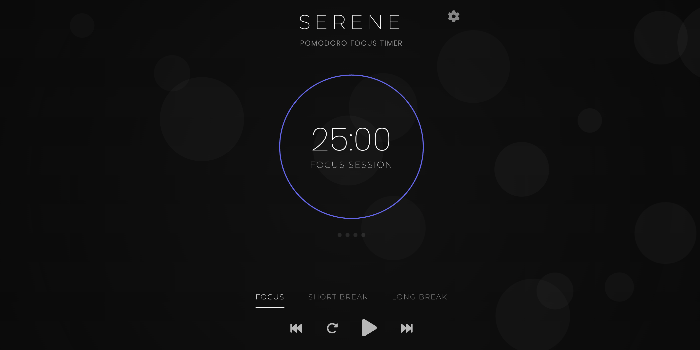

# Serene 🌿

> A minimal, distraction-free Pomodoro timer for deep focus

[](https://sarangnayak.github.io/Serene/)
[](LICENSE)
[](https://developer.mozilla.org/en-US/docs/Web/JavaScript)
[](https://bundlephobia.com/)



## ✨ Features

- **🕒 Clean Pomodoro Timer** – 25-minute focus sessions with smooth countdown
- **🎨 Soothing Interface** – Carefully chosen colors and animations to reduce eye strain
- **💾 Session Persistence** – Your timer state is saved automatically (even if you close the tab)
- **⚡ Blazing Fast** – Zero dependencies, pure vanilla JS for instant loading
- **♿ Accessible by Design** – Built with ARIA labels, keyboard navigation, and high contrast
- **📱 Responsive** – Works beautifully on desktop, tablet, and mobile
- **🌙 Theme Ready** – Codebase is structured for easy dark/light mode implementation

## 🚀 Quick Start

1. **Clone the repo**
   ```bash
   git clone https://github.com/sarangnayak/Serene.git
   cd Serene
   ```
